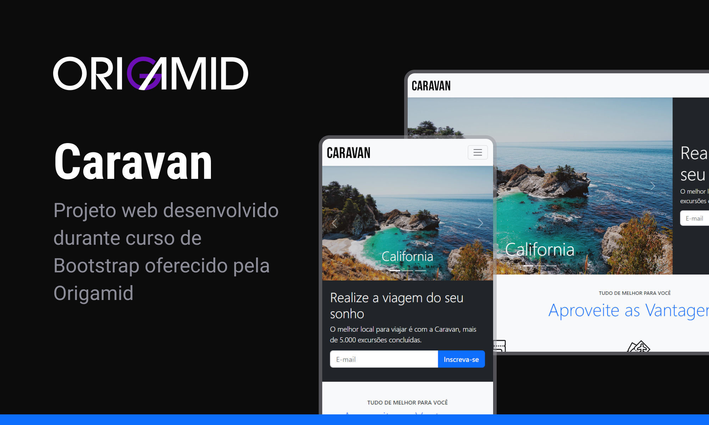

<h1 align="center"> Caravan </h1>

Projeto desenvolvido durante curso de Bootstrap da Origamid.
 
<a href="https://www.origamid.com/curso/bootstrap-4/">Estude esse projeto em formato de vídeo clicando aqui.</a>

  <a href="#-tecnologias">Tecnologias</a>&nbsp;&nbsp;&nbsp;|&nbsp;&nbsp;&nbsp;
  <a href="#-projeto">Projeto</a>&nbsp;&nbsp;&nbsp;|&nbsp;&nbsp;&nbsp;
  <a href="#-layout">Layout</a>&nbsp;&nbsp;&nbsp;|&nbsp;&nbsp;&nbsp;
  <a href="#memo-licença">Licença</a>

  

 

  

## 🚀 Tecnologias

Esse projeto foi desenvolvido com as seguintes tecnologias:

- HTML e CSS
- Bootstrap
- Git e Github
- Figma

## 💻 Projeto

Caravan é um site criado e estilizado usando o framework Bootstrap 5.

- [Acesse o projeto finalizado, online](https://diegoespelho.github.io/caravan/)

- [Assistir aulas](https://www.origamid.com/curso/bootstrap-4/)

## 🔖 Layout

O layout desse projeto foi todo desenvolvido utilizando a ferramenta Figma.

## 📝 Licença

Esse projeto está sob a licença MIT.

---

Feito com ♥ by Origamid 🐺

